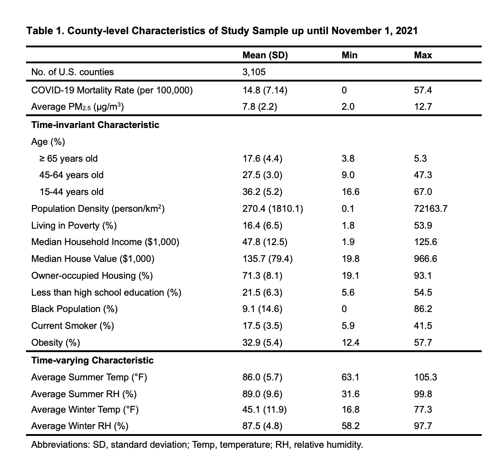

This project has two primary objetives: 1) to predict COVID-19 mortality on the county-level through 10/31/2021 using modified versions of previous models by Wu et al, and 2) explore how widespread availabilty of vaccines potentially changed the importance of predictors in our model. Code was modified based on open source provided by: https://github.com/wxwx1993/PM_COVID . This work led to the publication of the following study: "Wu, X., Nethery, R.C., Sabath, M.B., Braun, D. and Dominici, F., 2020. Air pollution and COVID-19 mortality in the United States: strengths and limitations of an ecological regression analysis. Science advances, 6(45), p.eabd4049" We thank all of the authors for making their data public and for enabling our project to be possible.


```{r}
library(dplyr)
library(stringr)
library(RCurl)
library(httr)

date_of_study <- "10-31-2021"

#Use Apr 15 as the Vax cutoff point
date_of_vax <- "04-15-2021"

```

## Import and Prepare Datasets

To isolate all of the necessary data for this project, we used Web Scraping to download county-level COVID mortality data from the Wu et al. study team Github. Our first step was to downloaod the the data used by Wu et al. (covid_histortical). We next downloaded data through the end our of study period 10/31/21, as well as long-term county level PM2.5 and temperature exposure data. 

```{r}
# Historical data
covid_historical <- read.csv(text = getURL("https://raw.githubusercontent.com/CSSEGISandData/COVID-19/master/csse_covid_19_data/csse_covid_19_daily_reports/03-30-2020.csv"))
covid_us_historical <- subset(covid_historical, Country_Region == "US" & is.na(FIPS) == F)

```

```{r}
# Import COVID Mortality data from JHU CSSE
df <- read.csv(text = getURL(paste0("https://raw.githubusercontent.com/CSSEGISandData/COVID-19/master/csse_covid_19_data/csse_covid_19_daily_reports/", date_of_study, ".csv")))
covid <- subset(df, Country_Region == "US")[, 1:12]
covid <- rbind(covid, subset(covid_us_historical, (!(FIPS %in% covid$FIPS)) & Confirmed == 0 & Deaths == 0 & is.na(FIPS) == F))
covid$FIPS <- str_pad(covid$FIPS, 5, pad = "0")

# Import Long-term Exposure PM2.5 and temperature data
county_pm <- read.csv(text = getURL("https://raw.githubusercontent.com/wxwx1993/PM_COVID/updated_data/Data/county_pm25.csv"))
county_temp <- read.csv(text = getURL("https://raw.githubusercontent.com/wxwx1993/PM_COVID/updated_data/Data/temp_seasonal_county.csv"))

```


```{r}
# Import census, brfss data as potential confounders
county_census <- read.csv(text = getURL("https://raw.githubusercontent.com/wxwx1993/PM_COVID/updated_data/Data/census_county_interpolated.csv"))

GET("https://www.countyhealthrankings.org/sites/default/files/media/document/analytic_data2020.csv", write_disk("county_brfss.csv", overwrite = TRUE))
county_brfss <- read.csv("county_brfss.csv", skip = 1)
county_brfss <- county_brfss[, c('fipscode', 'v011_rawvalue', 'v009_rawvalue')]
names(county_brfss) <- c('fips', 'obese', 'smoke')
county_brfss$fips <- str_pad(county_brfss$fips, 5, pad = "0")

state_test <- read.csv(text = getURL("https://api.covidtracking.com/v1/states/daily.csv"))
state_test <- subset(state_test, date == paste0(substring(str_remove_all(date_of_study, "-"), 5, 8),substring(str_remove_all(date_of_study, "-"), 1, 4)))[, - 38]
statecode <- read.csv(text = getURL("https://raw.githubusercontent.com/wxwx1993/PM_COVID/updated_data/Data/statecode.csv"))

hospitals <- read.csv(text = getURL("https://opendata.arcgis.com/datasets/6ac5e325468c4cb9b905f1728d6fbf0f_0.csv?outSR=%7B%22latestWkid%22%3A3857%2C%22wkid%22%3A102100%7D"))
hospitals$BEDS[hospitals$BEDS < 0] <- NA

county_base_mortality <- read.table(text = getURL("https://raw.githubusercontent.com/wxwx1993/PM_COVID/updated_data/Data/county_base_mortality.txt"), sep = "", header = TRUE)
county_old_mortality <- read.table(text = getURL("https://raw.githubusercontent.com/wxwx1993/PM_COVID/updated_data/Data/county_old_mortality.txt"), sep = "", header = TRUE)
county_014_mortality <- read.table("https://raw.githubusercontent.com/wxwx1993/PM_COVID/updated_data/Data/county_014_mortality.txt", sep = "", header = TRUE)
county_1544_mortality <- read.table("https://raw.githubusercontent.com/wxwx1993/PM_COVID/updated_data/Data/county_1544_mortality.txt", sep = "", header = TRUE)
county_4564_mortality <- read.table("https://raw.githubusercontent.com/wxwx1993/PM_COVID/updated_data/Data/county_4564_mortality.txt", sep = "", header = TRUE)

colnames(county_old_mortality)[4] <- c("older_Population")
colnames(county_014_mortality)[4] <- c("014_Population")
colnames(county_1544_mortality)[4] <- c("1544_Population")
colnames(county_4564_mortality)[4] <- c("4564_Population")

county_base_mortality <- merge(county_base_mortality,county_old_mortality[, c(2, 4)], by = "County.Code", all.x = TRUE)
county_base_mortality <- merge(county_base_mortality,county_014_mortality[, c(2, 4)], by = "County.Code", all.x = TRUE)
county_base_mortality <- merge(county_base_mortality,county_1544_mortality[, c(2, 4)], by = "County.Code", all.x = TRUE)
county_base_mortality <- merge(county_base_mortality,county_4564_mortality[, c(2, 4)], by = "County.Code", all.x = TRUE)

county_base_mortality$older_pecent <- county_base_mortality$older_Population / county_base_mortality$Population
county_base_mortality$"young_pecent" <- county_base_mortality$"014_Population" / county_base_mortality$Population
county_base_mortality$"prime_pecent" <- county_base_mortality$"1544_Population" / county_base_mortality$Population
county_base_mortality$"mid_pecent" <- county_base_mortality$"4564_Population" / county_base_mortality$Population
county_base_mortality$"older_pecent"[is.na(county_base_mortality$"older_pecent")] <- 0
county_base_mortality$"prime_pecent"[is.na(county_base_mortality$"prime_pecent")] <- 0
county_base_mortality$"mid_pecent"[is.na(county_base_mortality$"mid_pecent")] <- 0
county_base_mortality$"young_pecent"[is.na(county_base_mortality$"young_pecent")] <- 0

# Import NCHS Urban-Rural Classification Scheme for Counties
NCHSURCodes2013 <- read.csv("https://raw.githubusercontent.com/wxwx1993/PM_COVID/updated_data/Data/NCHSURCodes2013.csv")
NCHSURCodes2013$FIPS <- str_pad(NCHSURCodes2013$FIPS, 5, pad = "0")

```

## Variable Construction and Dataset Merge & Join

```{r}
# pm2.5 average over 17 years
county_pm_aggregated <- county_pm %>% 
    group_by(fips) %>% 
    summarise(mean_pm25 = mean(pm25))

# temperature and relative humidity average over 17 years
county_temp_aggregated <- county_temp %>% 
  group_by(fips) %>% 
  summarise(mean_winter_temp = mean(winter_tmmx),
            mean_summer_temp = mean(summer_tmmx),
            mean_winter_rm = mean(winter_rmax),
            mean_summer_rm = mean(summer_rmax))

county_pm_aggregated <- merge(county_pm_aggregated,
                              county_temp_aggregated,
                              by = "fips",
                              all.x = TRUE)

county_hospitals_aggregated <- hospitals %>% group_by(COUNTYFIPS) %>% summarise(beds = sum(BEDS, na.rm = TRUE))
county_hospitals_aggregated$COUNTYFIPS <- str_pad(county_hospitals_aggregated$COUNTYFIPS, 5, pad = "0")

county_census_aggregated2 <- subset(county_census, year == 2016)

# merge dataset
county_census_aggregated2$fips <- str_pad(county_census_aggregated2$fips, 5, pad = "0")
county_census_aggregated2 <- merge(county_census_aggregated2,county_brfss,
                                   by = "fips",
                                   all.x = TRUE)

county_pm_aggregated$fips <- str_pad(county_pm_aggregated$fips, 5, pad = "0")
aggregate_pm <- merge(county_pm_aggregated,covid,
                      by.x = "fips",
                      by.y = "FIPS")

aggregate_pm_census <- merge(aggregate_pm,
                             county_census_aggregated2,
                             by.x = "fips",
                             by.y = "fips")

county_base_mortality$County.Code <- str_pad(county_base_mortality$County.Code, 5, pad = "0")
aggregate_pm_census_cdc <- merge(aggregate_pm_census,
                                 county_base_mortality[, c("County.Code", 
                                                           "Population",
                                                           "older_pecent",
                                                           "young_pecent",
                                                           "prime_pecent",
                                                           "mid_pecent")],
                                 by.x = "fips",
                                 by.y = "County.Code",
                                 all.x = TRUE)

aggregate_pm_census_cdc <- aggregate_pm_census_cdc[is.na(aggregate_pm_census_cdc$fips) == F, ]

#Export Data
#write.csv(aggregate_pm_census_cdc,"aggregate_pm_census_cdc_211031.csv", row.names = FALSE)
#write.csv(aggregate_pm_census_cdc,"aggregate_pm_census_cdc_210415.csv", row.names = FALSE)

```

# Part 0: Maps of the US Covariates

```{r}
library(maps)
library(stringr)
library(RColorBrewer)
library(shiny)
library(shinythemes)

AllCounty <- map_data("county")
AllCounty %>% ggplot(aes(x = long, y = lat, group = group)) +
              geom_polygon(color = "red", fill = NA)

AllCounty$region <- str_to_title(AllCounty$region)
AllCounty$subregion <- str_to_title(AllCounty$subregion)

AllCounty <- left_join (AllCounty, aggregate_pm_census_cdc, by = c("region" = "Province_State", "subregion" = "Admin2")) 


AllCounty %>% ggplot(aes(x = long, y = lat, group = group, fill = mean_pm25)) + 
   scale_color_discrete(name = "Average PM 2.5") +
                geom_polygon(color = "black") +
                scale_fill_gradientn(colors = brewer.pal(9, "Reds"), trans = "log10") +
   theme(panel.grid.major = element_blank(), 
         panel.background = element_blank(),
         axis.title = element_blank(), 
         axis.text = element_blank(),
         axis.ticks = element_blank())
                coord_fixed(1.3)
   
                
              
  # Define UI
  shinyApp(           
ui = fluidPage( 
    titlePanel("Life Expectancy in the US over Time"),
    
    # Sidebar
    sidebarLayout(
        
        # Widgets for selection
        sidebarPanel(  radioButtons(inputId = "covariate", label = "Select a Covariate",
                         choices = c("mean_pm25 ", "mean_winter_temp", "mean_summer_temp ")),
        ),
        
        # Main panel
        mainPanel(
            # Plot
            plotOutput("plot")
        )
    )
)
,
server = function(input, output){
    output$plot = renderPlot({
    ggplot(data = AllCounty, aes_string(x = 'long', y = 'lat', group = 'group', fill = input$covariate)) + 
   scale_color_discrete(name = "Average PM 2.5") +
                geom_polygon(color = "black") +
                scale_fill_gradientn(colors = brewer.pal(9, "Reds"), trans = "log10") +
   theme(panel.grid.major = element_blank(), 
         panel.background = element_blank(),
         axis.title = element_blank(), 
         axis.text = element_blank(),
         axis.ticks = element_blank())+
          coord_fixed(1.3) +
        ggtitle(paste(input$covariate, "arrests per 100,000 (log scale)"))
    })
}

)

                
                
```


# Part 1: Regression models: predicting COVID mortality risk

In Part I, we will firstly summarize the characteristics of the US county-level study cohort up to Nov. 1, 2021. Then we will be using linear regression models to predict mean COVID mortality rate (per 100,000), and logistic regression models to predict the probablity of mortality rate >= median value.

## Step 0: read in the dataset

```{r}

library(dplyr)
library(ggplot2)
library(plotly)
library(Matrix)
library(MASS)
library(lme4)

df <- aggregate_pm_census_cdc
```


## Step 1: Descriptive Analysis and Correlation Plot

In step 1, we conduct a descriptive analysis of our key variables, COVID-19 mortality and PM2.5 exposure, and 17 covariates including population density, percent of population ≥ 65 years of age, percent of the population 45-64 years of age, percent of the population 15-44 years of age, percent of the population living in poverty, median household income, percent of Black residents, percent of Hispanic residents, percent of the adult population with less than high school education, median house value, percent of owner-occupied housing, percent of the population with obesity, percent of current smokers, and average daily temperature and relative humidity for summer (June to September) and winter (December to February) for each county. In addition, we conduct a correlation test and plot out the association between COVID-19 mortality and PM2.5 exposure.

```{r}
library(pastecs)

# Calculate COVID-19 mortality rate and prepare sample dataset for analysis
reg_data <- df %>% mutate(Mortality = Deaths/Population * 100000)


# Descriptive Analysis
desvars <- c("Mortality", "Deaths", "mean_pm25", "smoke", "obese", "poverty", "no_grad", "owner_occupied", "hispanic_pct", 
             "blk_pct", "age_pct_65_plus", "age_pct_45_65", "age_pct_15_44", "population_density", "median_household_income", 
             "median_house_value", "mean_summer_temp", "mean_winter_temp", "mean_summer_rm", "mean_winter_rm")
stat.desc(reg_data[desvars], p = 0.95)

```

We summarized the descriptive analysis results into the table below.


We included 3105 U.S counties which reported daily COVID-19 infected and death cases. County-level COVID-19 mortality rates were defined for our analyses as the ratio of COVID-19 deaths to county-level population size.

On average, 17.6% of the US country-level population aged over 65 yrs; 16.4% of the population are living under the federal poverty standard; 71.3% of the household owned their house, and the percentage of people with less than high school education is 21.5%.

```{r}
library(ggplot2)
library(ggpubr)

# Correlation Plot
ggscatter(
   reg_data, 
   x = "mean_pm25", 
   y = "Mortality", 
   add = "reg.line", 
   conf.int = TRUE, 
   cor.coef = TRUE, 
   cor.method = "spearman", 
   color = "gray", 
   add.params = list(color = "black"),
   sample = 18,
   palette = "uchicago",
   xlab = "PM2.5 (ug/m^3)", 
   ylab = "COVID-19 Mortality Rate (per 100,000)",
   title = "Correlation between COVID-19 Mortality and PM2.5") # R = 0.22

ggsave("correlation_plot.tiff", units="in", width=6, height=6, dpi=200, compression = 'lzw') 

```

Our Figure 1 in Part I is shown above, based on Figure 1, we can see that the correlation coefficient is 0.22 with a p-value < 0.001.


## Step 2: Linear Regression Model: predict the mean COVID mortality rate adjusted by demographics, socioeconomic status, behavior risk factors, and environmental conditions.

In this part, we are using linear models to predict mean COVID mortality rate. Our predictor of interest is *PM2.5 exposure*, which is measured as the 17-year average concentration 2000-2016 by [van Donekelaar et al](https://pubs.acs.org/doi/10.1021/acs.est.8b06392). To adjust for confounding bias in the nationwide observational study, we use county-level variables from numerous public sources: (1) [US Census/American Community Survey](https://www.census.gov/programs-surveys/acs/data.html), (2) [Robert Wood Johnson Foundation County Health Rankings](https://www.countyhealthrankings.org/), (3) [Gridmet via Google Earth engine](http://www.climatologylab.org/gridmet.html). We will also consider the potential effect of nationwide vaccination campaigns since April 15, 2021.

```{r}
# read in COVID dataset before Vaccination become nationwide available (before April 15, 2021)
# Calculate COVID-19 mortality rate and prepare sample dataset for analysis

df_bfVax <- read.csv("/Users/jenniferdai/Desktop/BST260-Final-Project/Data/aggregate_pm_census_cdc_210415.csv")
reg_data_bfVax <- df_bfVax %>% mutate(Mortality = Deaths/Population * 100000)

```


```{r}
library(emmeans)

# crude model, predictor: PM2.5 exposure
lm_fit = lm(log(1 + Mortality) ~ mean_pm25, data = reg_data)
summary(lm_fit)
lsmeans(lm_fit,  ~ mean_pm25)

```
Based on the result of crude model, we observed a positive association between COVID-19 mortality rate and long-term PM2.5 exposure. 1 ug/m^3 increase of 17-years average PM2.5 exposure is associated with 7.6% increase of COVID-19 mortality rate on the county-level.


### Full Data up until Nov. 1, 2021
```{r}
# Mortality Date up until Nov. 1, 2021
# Adjusted by demographics, socioeconomic status, behavior risk factors, and environmental conditions
# Scale covariates in order to make it easier to interpret regression coeffcients

lm_fit_adjusted = lm(log(1 + Mortality) ~ mean_pm25 + 
                        scale(smoke) + 
                        scale(obese) + 
                        scale(poverty) + 
                        scale(no_grad) + 
                        scale(owner_occupied) + 
                        scale(blk_pct) + 
                        scale(hispanic_pct) +
                        scale(age_pct_65_plus) +
                        scale(age_pct_45_65) +
                        scale(age_pct_15_44) +
                        scale(log(population_density)) +
                        scale(log(median_household_income)) +
                        scale(log(median_house_value)) +
                        scale(mean_summer_temp) + scale(mean_winter_temp) + scale(mean_summer_rm) + scale(mean_winter_rm) +
                        offset(log(Population)), data = reg_data)

summary(lm_fit_adjusted)
lsmeans(lm_fit_adjusted, ~ mean_pm25)

??lsmeans
          
```

**Full Data up until Nov. 1, 2021**: Overall, the F-statistics is 160 with the p-value < 0.001. We can use linear model to fit our regression. After adjusting for demographics, socioeconomic status, behavior risk factors, and environmental conditions, the estimate coefficient of PM2.5 exposure is 0.09 with a p-value < 0.001, which indicates 1 ug/m^3 increase of 17-years average PM2.5 exposure is associated with 9.1% increase of COVID-19 mortality rate on the county-level. In addition, coefficients of the older age distribution, the percentage of people living in poverty, the percentage of hispanic population, and the percentage of current smoker were all significant at the 5% level, which showed that these factors were strong predictors for COVID-19 mortality rate in a relatively longer time window (from March 2020 to November 2021).

Specifically, the results showed a significant inequity situation in COVID-19 related health disparities among some vulnerable population. We found a 19.4% increase in COVID-19 mortality risk was significantly associated with a 1-SD (per 6.3%) increase in the percentage of people with less than high school education within county-level. It also suggested that a 4.4% increase in the percentage of people aged over 65 was significantly associated with a 19.9% increase in COVID-19 death risk. In addition, we did not find significant association between percentage of black population and COVID-19 mortality risk on the county-level.


### Pre-vaccination Data up until Apr. 15, 2021
```{r}
# Mortality Date up until Apr. 15, 2021
# Adjusted by demographics, socioeconomic status, behavior risk factors, and environmental conditions
# Scale covariates in order to make it easier to interpret regression coeffcients

lm_fit_adjusted_bfVax = lm(log(1 + Mortality) ~ mean_pm25 + 
                        scale(smoke) + 
                        scale(obese) + 
                        scale(poverty) + 
                        scale(no_grad) + 
                        scale(owner_occupied) + 
                        scale(blk_pct) + 
                        scale(hispanic_pct) +
                        scale(age_pct_65_plus) +
                        scale(age_pct_45_65) +
                        scale(age_pct_15_44) +
                        scale(log(population_density)) +
                        scale(log(median_household_income)) +
                        scale(log(median_house_value)) +
                        scale(mean_summer_temp) + scale(mean_winter_temp) + scale(mean_summer_rm) + scale(mean_winter_rm) +
                        offset(log(Population)), data = reg_data_bfVax)

summary(lm_fit_adjusted_bfVax)
#lsmeans(lm_fit_adjusted_bfVax, ~ mean_pm25)
#> summary(reg_data_bfVax$age_pct_65_plus)
#   Min. 1st Qu.  Median    Mean 3rd Qu.    Max. 
#0.03855 0.14829 0.17280 0.17635 0.19944 0.53106
# Std. Dev. of age_pct_65_plus = .044
#lsmeans(lm_fit_adjusted_bfVax, "mean_pm25", by = "age_pct_65_plus", at = list(age_pct_65_plus = c(0.13, 0.22)))

```

**Pre-vaccination Data up until Apr. 15, 2021**: Overall, the F-statistics is 159.5 with the p-value < 0.001. We can use linear model to fit our regression. After adjusting for demographics, socioeconomic status, behavior risk factors, and environmental conditions, the estimate coefficient of PM2.5 exposure is 0.08 with a p-value < 0.001, which indicates 1 ug/m^3 increase of 17-years average PM2.5 exposure is associated with 8% increase of COVID-19 mortality rate on the county-level. In addition, coefficients of the older age distribution, the percentage of people living in poverty, the percentage of black and hispanic population, and the percentage of current smoker were all significant at the 5% level, which showed that these factors were strong predictors for COVID-19 mortality rate before COVID-19 Vaccine become nationwide available (from March 2020 to mid-Apr 2021).

In addition, we observed a sightly decrease in the magnitude of estimate coefficient for PM2.5 exposure comparing to linear model based on full data. One of the reason may be that PM2.5 exposure has delayed long-term health effect on COVID-related mortality risk. So we observed a stronger effect in pre-vaccination dataset up until Apr. 15, 2021. 

Specifically, the results also showed a significant inequity situation in COVID-19 related health disparities among some vulnerable population. We found a 20.6% increase in COVID-19 mortality risk was significantly associated with a 1-SD increase in the percentage of people with less than high school education within county-level. It also suggested that a 1-SD increase in the percentage of people aged over 65 was significantly associated with a 25.1% increase in COVID-19 death risk. In addition, we found a significant positive association between percentage of black population and COVID-19 mortality risk on the county-level.

If we compare two linear models above, we can see a decrease of estimate coefficient for `no_grad` and `age_pct_65_plus` after the launch of COVID-19 vaccination campaigns, which means that COVID-19 vaccine mitigates the effect of demographics/socioeconomic status on COVID-19 mortality risk. We also found a no significant association between percentage of black population and COVID-19 mortality risk after including more data points after vaccination. The result also suggests that COVID-19 vaccination protects vulnerable population like black people from Covid-19 deaths.


## Step 3: Logistic Regression Model: predict odds of COVID-19 mortality >= median value (compared to COVID-19 mortality rate less than median value) for Full Data and Pre-vaccination Data

Since there are extreme values in COVID-19 mortality rates of large metropolitan like NYC, LA, etc., we also dichotimized mortality into a binary variable (for example, in full data, >= 14.07 deaths per 100,000 vs. < 14.07 deaths per 100,000) and again fit the associations using logistic regression models:

```{r}

reg_data_log <- reg_data %>%
   mutate(Mortality_new = ifelse(Mortality >= 14.07, 1, 0))

logit_fit_adjusted = glm(Mortality_new ~ mean_pm25 + 
                        scale(smoke) + 
                        scale(obese) + 
                        scale(poverty) + 
                        scale(no_grad) + 
                        scale(owner_occupied) + 
                        scale(blk_pct) + 
                        scale(hispanic_pct) +
                        scale(age_pct_65_plus) +
                        scale(age_pct_45_65) +
                        scale(age_pct_15_44) +
                        scale(log(population_density)) +
                        scale(log(median_household_income)) +
                        scale(log(median_house_value)) +
                        scale(mean_summer_temp) + scale(mean_winter_temp) + scale(mean_summer_rm) + scale(mean_winter_rm)
                        , data = reg_data_log, family = "binomial")

summary(logit_fit_adjusted)
exp(coef(logit_fit_adjusted))

```

**Full Data up until Nov. 1, 2021**: The estimate coefficient could be interpreted as the probability of COVID-19 mortality rate >= 14.07 deaths per 100,000 associated with a 1 μg/m3 change in 17-years average PM2.5 exposure on county-level. Comparing to linear regression model, the estimate coefficient of PM2.5 exposure in logistic regression is not sigificant on the 5% level, which may suggest that linear regression model is better to fit the relationship of COVID-19 mortality risk and PM2.5 exposure in a relatively longer time window (from March 2020 to November 2021). 

Similar to findings in the linear regressions results, after adjusting for confounders, coefficients of the age distribution, the percentage of people with less than high school education, the median house value were all significant at the 5% level, which showed that these factors were strong predictors for odds of higher COVID-19 mortality risk in a relatively longer time window (from March 2020 to November 2021).


```{r}

reg_data_log_bfVax <- reg_data_bfVax %>%
   mutate(Mortality_new = ifelse(Mortality >= 10.08, 1, 0))

logit_fit_adjusted_bfVax = glm(Mortality_new ~ mean_pm25 + 
                        scale(smoke) + 
                        scale(obese) + 
                        scale(poverty) + 
                        scale(no_grad) + 
                        scale(owner_occupied) + 
                        scale(blk_pct) + 
                        scale(hispanic_pct) +
                        scale(age_pct_65_plus) +
                        scale(age_pct_45_65) +
                        scale(age_pct_15_44) +
                        scale(log(population_density)) +
                        scale(log(median_household_income)) +
                        scale(log(median_house_value)) +
                        scale(mean_summer_temp) + scale(mean_winter_temp) + scale(mean_summer_rm) + scale(mean_winter_rm)
                        , data = reg_data_log_bfVax, family = "binomial")

summary(logit_fit_adjusted_bfVax)
exp(coef(logit_fit_adjusted_bfVax))


```

**Pre-vaccination Data up until Apr. 15, 2021**: Similar to full dataset, the estimate coefficient could be interpreted as the probability of COVID-19 mortality rate >= 10.08 deaths per 100,000 associated with a 1 μg/m3 change in 17-years average PM2.5 exposure on county-level. Comparing to linear regression model, the estimate coefficient of PM2.5 exposure in logistic regression is not sigificant on the 5% level, which may suggest that linear regression model is better to fit the relationship of COVID-19 mortality risk and PM2.5 exposure before COVID-19 Vaccine become nationwide available (from March 2020 to mid-Apr 2021). 


In addition, coefficients of the age distribution, the percentage of people with less than high school education, the percentage of black and hispanic population, and the percentage of current smoker were all significant at the 5% level, which showed that these factors were strong predictors for odds of higher COVID-19 mortality risk before COVID-19 Vaccine become nationwide available (from March 2020 to mid-Apr 2021).

If we compare two linear models above, the results also showed a mitigation effect of vaccination on COVID-19 death regarding various health disparities among vulnerable population. We found no significant coefficient estimates for `poverty`, `smoke`, `blk_pct`, `hispanic_pct` and `age_pct_65_plus` after including more data points after vaccination. The result suggested that COVID-19 vaccine mitigated the effect of demographics/socioeconomic status on COVID-19 mortality risk across county-level. In other words, COVID-19 vaccinations protect vulnerable population like black people, people aged over 65, and people living in poverty from Covid-19 deaths.

## Load libraries
```{r}
#libraries
library(dplyr)
library(stringr)
library(tidyverse)
library(splitstackshape)
library(httr)
library(caret)
library(ggplot2)
library(mlbench)
library(Boruta)
library(DataExplorer)
library(ggstatsplot)
library(ggcorrplot)
library(lares)
library(randomForest)
library(MASS)
library("faux")
library(skimr)
library(nnet)
library(e1071)
set.seed(260)
```

## Load data
```{r}
## load preprocessed data by XB, create a variable for county-level COVID-19 death rate
df_complete <- aggregate_pm_census_cdc_211031 %>% mutate(rate = (Deaths / (Population / 100000)))
names(df_complete)
## drop redundant variables
todrop <- c("fips","Admin2","Recovered","Active", "q_popdensity","Last_Update", "year", "Country_Region", "NAME", "population", "mid_pecent", "prime_pecent", "older_pecent" ,"young_pecent")
df_complete <- df_complete[ , !(names(df_complete) %in% todrop)]
df <- df_complete %>% 
  subset(Province_State != "Utah") %>% 
  rename_all(recode, Combined_Key = "County") %>% 
  remove_rownames %>% 
  column_to_rownames(var = "County")
# Utah reported no cases or deaths info
##view data
head(df)
names(df)
glimpse(df)
```
## Remove NAs
```{r}
which(is.na(df$rate))
## Row 2379, Population and rate is missing.
df <- df[-2379,]
```

## Split data
```{r}
set.seed(1)
index_train<- createDataPartition(y = df$rate, times =1, p=0.8, list = FALSE)
train_set <- slice(df, index_train)
test_set <- slice(df, -index_train)
dim(train_set)
dim(test_set)
```

## Machine Learning model

```{r}
## We fit a Random Forest by using the `randomForest()` function. Here, `mtry = 18` indicates all 18 predictors should be considered for each split of the tree - in other words, bagging should be done.
set.seed(1)
fit_rf_1 <- randomForest(rate ~ mean_pm25 + smoke + obese + poverty + no_grad + owner_occupied + hispanic_pct + blk_pct + age_pct_15_44 + age_pct_45_65 + age_pct_65_plus + population_density + median_house_value + median_household_income + mean_winter_temp + mean_summer_temp + mean_winter_rm + mean_summer_rm, data = train_set, mtry = 18, importance = TRUE)
fit_rf_1
##How well does this model perform?
preds_bag = predict(fit_rf_1, newdata = test_set)
plot(preds_bag, test_set$rate)
abline(0,1)
mean((preds_bag - test_set$rate)^2) 
#With Random Forest (mtry = 18), we get an MSE of 26.3.
```

```{r}
## RF model with mtry = p/3 = 6 (the de)
set.seed(1)
fit_rf_2 <- randomForest(rate ~ mean_pm25 + smoke + obese + poverty + no_grad + owner_occupied + hispanic_pct + blk_pct + age_pct_15_44 + age_pct_45_65 + age_pct_65_plus + population_density + median_house_value + median_household_income + mean_winter_temp + mean_summer_temp + mean_winter_rm + mean_summer_rm, data = train_set, mtry = 6, importance = TRUE)
fit_rf_2
##How well does this model perform?
preds_rf_2 = predict(fit_rf_2, newdata = test_set)
plot(preds_rf_2, test_set$rate)
abline(0,1)
mean((preds_rf_2 - test_set$rate)^2)
# With Random Forest (mtry = 6), we get an MSE of 25.9.
```


```{r}
library(knitr)
variable_importance <- importance(fit_rf_2) 
tmp <- tibble(feature = rownames(variable_importance),
                  Gini = variable_importance[,1]) %>%
                  arrange(desc(Gini))
kable(tmp[1:10,])
## The top 10 important predictors are: average summer temperature, median house value, %smokers, %>= 65 years of age, median household income, no_grad (% less than high school???), average pm2.5, average winter temperature...
tmp %>% filter(Gini > 20) %>%
        ggplot(aes(x=reorder(feature, Gini), y=Gini)) +
        geom_bar(stat='identity') +
        coord_flip() + xlab("Feature") +
        theme(axis.text=element_text(size=8))
```
### Load Libraries

```{r, echo = FALSE}
#libraries
library(dplyr)
library(stringr)
library(tidyverse)
library(RCurl)
library(httr)
library(caret)
library(ggplot2)
library(mlbench)
library(Boruta)
library("DataExplorer")
library(ggstatsplot)
library(ggcorrplot)
library(lares)
library(randomForest)
library("faux")
library(skimr)
library(nnet)
library(e1071)
set.seed(260)
```

## Load Preprocess data

You can also embed plots, for example:

```{r}
df_complete = read.csv("../Data/aggregate_pm_census_cdc.csv")
dim(df_complete) # shape of data
head(df_complete) # brief look at data
names(df_complete) # all included variables
```

There are a total of 47 variables in this data that was combined from [multiple sources](https://github.com/steventang26/BST260-Final-Project/blob/master/README.md).
Of this data there are over 3000 counties and resulting dependent variables--which
we are looking at either COVID cases or COVID deaths.

```{r}
# drop all repeated variables and keep wanted 
# keep Population as the correct variable
todrop = c("fips","Admin2","Active", "q_popdensity","Last_Update", "year", "Country_Region", "NAME", "population", "poverty_mcare", "Recovered")
df_prelim <- df_complete %>% 
  select(-todrop) %>% 
  subset(Province_State != "Utah") %>% 
  rename_all(recode, Combined_Key = "County") %>% 
  remove_rownames %>% 
  column_to_rownames(var = "County") %>% 
  select(-Province_State) %>% # Utah reported no cases or deaths info
  mutate(rate = (Deaths / (Population / 100000)))
  
names(df_prelim)
glimpse(df_prelim)
```


### Exploratory Data Analysis

```{r}
#states = rownames(df[which(df["Deaths"] > 10000),]) #points to label
#rownames(df[states,])
plot_intro(df_prelim) # shows data.nas
#ggstatsplot::ggcorrmat(
#  data = df,
#  type = "parametric", 
#  colors = c("darkred", "white", "steelblue")) # change default colors
## too many variables in ugly correlation plot
  #geom_text(label = rownames(df[states,]))
```

```{r}
# dropping these variabls as redundant with age_pct variables avoid collinearity
todropmore = c("mid_pecent", "prime_pecent", "older_pecent" ,"young_pecent", "Deaths") 
desvars <- c("rate", "mean_pm25", "smoke", "obese", "poverty", "no_grad", "owner_occupied", "hispanic_pct", "blk_pct", "age_pct_65_plus", "age_pct_45_65", "age_pct_15_44", "population_density", "median_household_income", "median_house_value", "mean_summer_temp", "mean_winter_temp", "mean_summer_rm", "mean_winter_rm")
df <- df_prelim %>% 
  select(-todropmore) %>% 
  select(desvars)
plot_correlation(df)
# Picture of Variables
skimmed <- skim_to_wide(df)
skimmed[, c(1,2,4,5,8:12)]
#ggplot(df, aes(x = Confirmed, y = Deaths)) +
#  geom_point(size = 1) +
#  scale_x_log10() +
#  scale_y_log10() ## not a meaningful plot
corr_cross(df, 
  max_pvalue = 0.05, # display only significant correlations (at 5% level)
  top = 15)
# highest correlations with COVID death rates
corr_var(df, # name of dataset
  rate, # name of variable to focus on
  top = 20, # display top 5 correlations
  max_pvalue = 0.05)
#find cases with NAs
df_missing = df[!complete.cases(df), ]
df_missing #showing rows
# removed 1 county with no smoke data
df <- df[!(row.names(df) %in% "Oglala Lakota, South Dakota, US"), ]
plot_intro(df)
```


Preliminary look shows that interestingly PM2.5 values, age above 65yo, and smoking have low correlations with COVID death numbers.

### Feature Selection Explore

#```{r eval= FALSE}
# Define the control using a random forest selection function
control <- rfeControl(functions = rfFuncs, # random forest
                      method = "repeatedcv", # repeated cv
                      repeats = 2, # number of repeats
                      number = 5) # number of folds
# Independent Variables
x <- df %>%
  select(-rate) %>%
  as.data.frame()
# Target variable
y <- df$rate
# Training: 80%; Test: 20%
set.seed(260)
inTrain <- createDataPartition(y, p = .80, list = FALSE)[,1]
x_train <- x[ inTrain, ]
x_test  <- x[-inTrain, ]
y_train <- y[ inTrain]
y_test  <- y[-inTrain]
dim(x_train)
length(y_train)
# Run RFE
result_rfe1 <- rfe(x = x_train, 
                   y = y_train, 
                   sizes = 10,
                   rfeControl = control)
# ran combination of 10 best predictors
# Print the results
result_rfe1
# Print the selected features
predictors(result_rfe1)
### Machine Learning Analysis `Support Vector Regression`
```{r cache = TRUE}

#split again with deaths variable
index_train<- createDataPartition(y = df$rate, times =1, p=0.8, list = FALSE)
train_set <- slice(df, index_train)
test_set <- slice(df, -index_train)

dim(train_set)
dim(test_set)

## Trying SVR Model
#Regression with SVM
#with top 10 correlated
modelsvm = svm(rate ~ mean_summer_temp + no_grad + median_house_value + median_household_income+ mean_winter_temp+ poverty+ smoke+ blk_pct+ obese+ age_pct_45_65+ mean_pm25, train_set)

#Predict using SVM regression
predYsvm = predict(modelsvm, test_set)

#just to see
test_set$rate[10:20]
predYsvm[10:20]

summary(modelsvm)

W = t(modelsvm$coefs) %*% modelsvm$SV

#Find value of b
b = modelsvm$rho

## RMSE for SVR Model

#Calculate RMSE 
RMSEsvm=rmse(predYsvm,test_set$rate)
RMSEsvm
R2(predYsvm,test_set$rate)
## Tuning SVR model by varying values of maximum allowable error and cost parameter

#Tune the SVM model
OptModelsvm = tune(svm, rate ~ mean_summer_temp + no_grad + median_house_value + median_household_income+ mean_winter_temp+ poverty+ smoke+ blk_pct+ obese+ age_pct_45_65+ mean_pm25, data = train_set, ranges=list(elsilon=seq(0,1,0.5), cost = 1:100))

#Print optimum value of parameters
print(OptModelsvm)

#Plot the performance of SVM Regression model
plot(OptModelsvm)

#Find out the best model
#BstModel=OptModelsvm$best.model

#Predict Y using best model
#PredYBst=predict(BstModel,test_set)

#Calculate RMSE of the best model 
#RMSEBst=rmse(PredYBst,test_set$rate)
#RMSEBst #better RMSE value than untuned model

##Calculate parameters of the Best SVR model

#Find value of W
#Wbest = t(BstModel$coefs) %*% BstModel$SV

#Find value of b
#b_best = BstModel$rho

#RMSE(PredYBst, test_set$rate)
#modelsvm = svm(rate ~ ., train_set)

# not very good performance on the models thru RMSE and Squared values
# simpler approach is to 
#mean(df$rate)

```
```{r}
# determine the variables to run on
# should i run a lasso?
```{r}
```


```{r}
```


```{r}
extra
```


https://towardsdatascience.com/effective-feature-selection-recursive-feature-elimination-using-r-148ff998e4f7
https://topepo.github.io/caret/train-models-by-tag.html#neural-network
